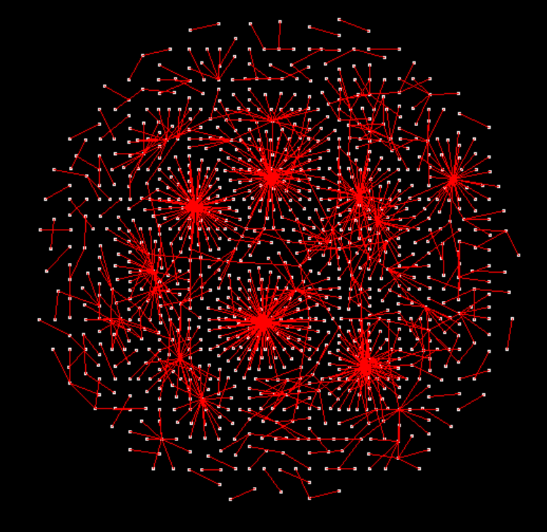
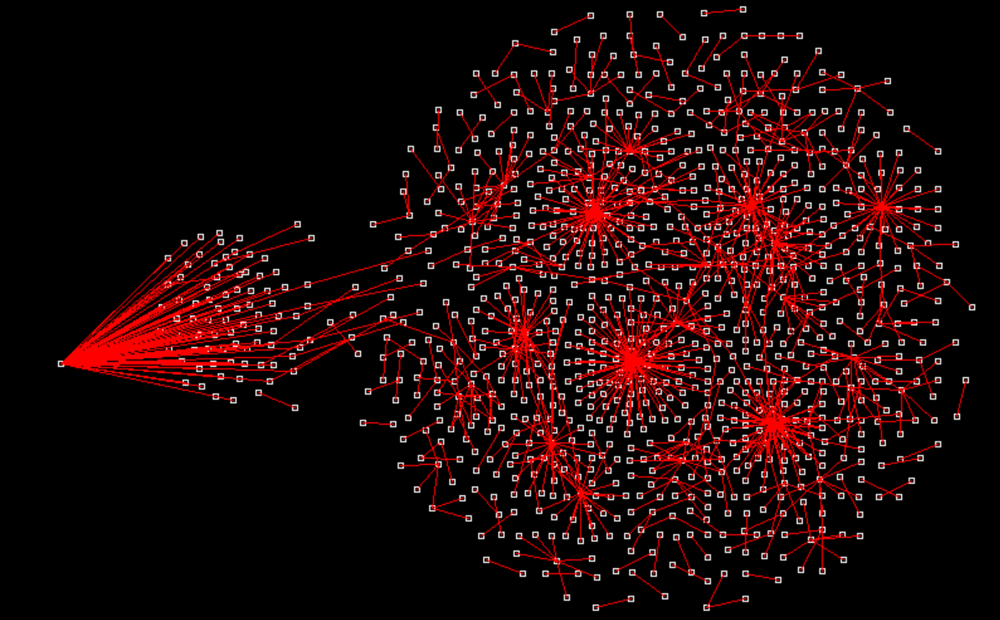

# SDL2 Network Graph
Disclaimer: I am completely new to rust. This is likely not very "idiomatic". Be kind
## Description
This is a dirty mockup of an engine for displaying network graphs with physics applied to the nodes.

This is largely inspired by the barnes hut model from [vis.js](https://visjs.org/), particularly the physics based [barnes hut models](https://visjs.github.io/vis-network/examples/network/other/configuration.html). I did not implement the barnes hut algorithm in any form, but rather implemented the following physics forces to achieve a similar effect:
- Central gravity
- Gravity between nodes
- Repulsion between nodes 
- Spring tension

## Controls
- Left click and drag nodes to move them
- Left click and drag the background to pan
- Use the scroll wheel to zoom and pan
- Press escape to exit

## Requirements
**For windows**: I've included the SDL2 DLL within the debug and release target folders, but you will need to follow the rest of the associated steps provided in the [Rust-SDL2 Readme](https://github.com/Rust-SDL2/rust-sdl2?tab=readme-ov-file#windows-msvc).
In short:
- Download `SDL2-devel-2.x.x-VC.zip`
- Copy the lib files from `{extracted}/lib/x64/` to `%userprofile%\.rustup\toolchains\{current toolchain}\lib\rustlib\{current toolchain}\lib`

**For Linux/MacOS**: Just follow the simple instructions in the [readme](https://github.com/Rust-SDL2/rust-sdl2?tab=readme-ov-file)

## Images

**Click and drag nodes**
